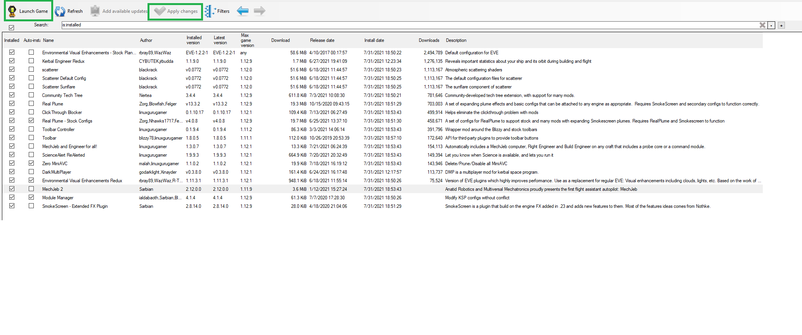
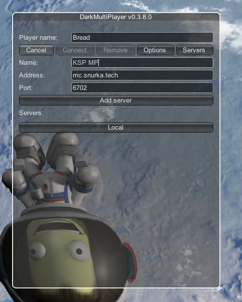

# KSP-MP-info

# How to join the server from step 1

1. Download the latest version of KSP from Steam
2. Download the latest version of [CKAN](https://github.com/KSP-CKAN/CKAN/releases/download/v1.30.4/ckan.exe)
	1. Install CKAN, pointing to the Build64ID.txt file in your Steam's KSP Install Directory
3. Download the [CKAN Modlist](https://github.com/Birdgeek/KSP-MP-info/releases/download/Science-Update1/modlist.ckan) File from this Repo
4. Within the CKAN application click File > Install from .ckan > Browse to where you just downloaded the CKAN Modlist file to > select this file

7. With all the mods select (double check by applying the "installed" filter), click Launch Game
8. Once at the main menu, change the Player name as you like under the DarkMultiPlayer (DMP) pane on the right
9. Click Add in the DMP pane
10. Give the sever some sort of name you'll remember
11. Enter mc.snurka.tech as the address
12. Leave the port as the default 6702
13. Click Add Server
14. To join, click the sever button as you've named it in the server list under the DMP pane.

# Once Loading the game
You can safely ignore any warnings about MechJeb2 being incompatible. It's fine.
Please click the Sync button withing the DMP pane to the person further ahead each time before you launch. This is so that we will all stay mostly in sync and if one player puts up a comm sat, the other player's launch can utilize that comm sat.

On the Click Through Blocker Pane when first login, select Focus-Follows-Mouse > Save as global default for all new saves > Accept
On the Toolbat Controller Intro > Hide this window at startup

Feel free to minimize the DMP chat by click the chat button in the DMP pane
Craft = Allows for sharing craft between people from the VAB
Group = The group the craft are shared via
Permissions = IDK
Screenshot = Screenshot
- = Minimize, turns into + to Maximze

Feel free to randomize a color under the DMP pane > Options
